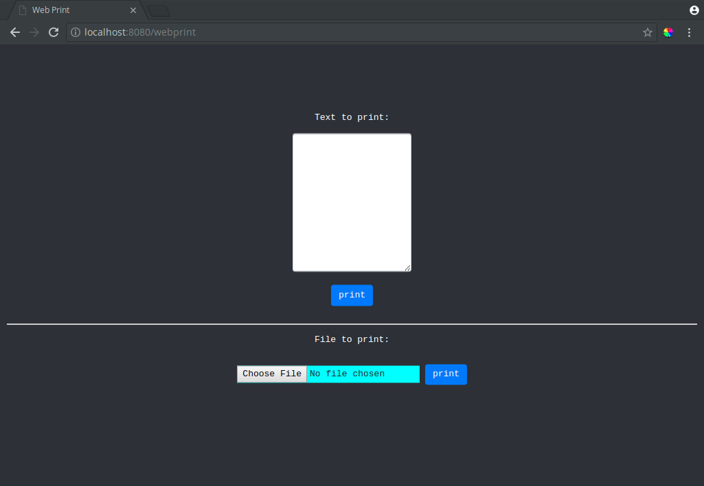

# thermalwebprint
A REST webservice and webclient to print to a networked CUPS printer 

# Goals
print to a CUPS server (aka a recipt printer) from REST and webclient

# Notes (bad things)
+ We host everything through falcon. Hosting the /assets through apache or somthing of the like would be faster and safer.
+ We write to disk. (the scratch file) This was the quickest and easiest way.
+ The printer is hardcoded

# image
